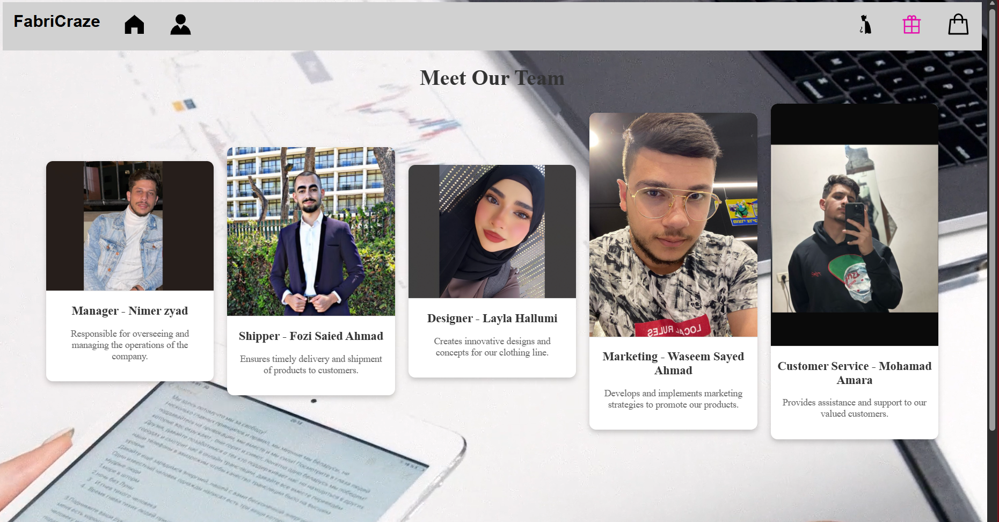
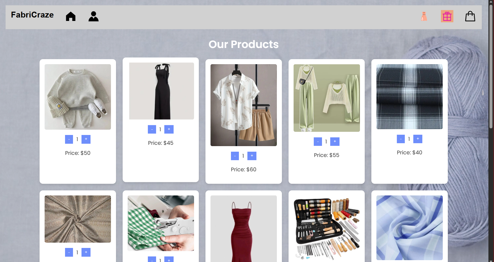
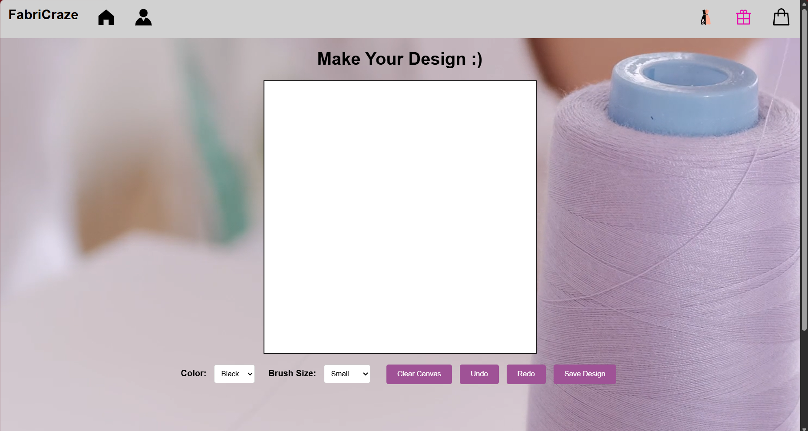
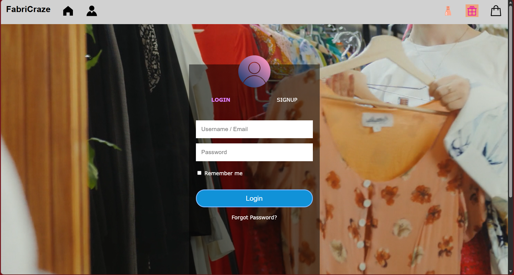

# FabriCraze Ecommerce Website

## Overview
FabriCraze is a responsive multi-page ecommerce fashion website prototype developed using HTML, CSS, and JavaScript.

The project focuses on delivering an interactive and visually engaging online shopping experience with customization-oriented fashion concepts, product browsing, authentication pages, and multimedia integration.

This project demonstrates frontend web development, UI/UX design principles, responsive layouts, and client-side interactivity.

---

## Features
- Multi-page ecommerce website
- Fashion product browsing
- DIY/custom clothing concept pages
- Login and signup interface
- Gift card section
- Responsive layouts
- Multimedia integration (images and videos)
- Interactive frontend behavior using JavaScript

---

## Technologies Used
- HTML5
- CSS3
- JavaScript
- Responsive Web Design

---

## Project Structure

```text
photos/         Image assets
videos/         Video assets
screenshots/    Project screenshots
*.html          Website pages
style.css       Main styling file
index.js        Frontend interactivity
```

---

## Screenshots

### Home Page


### Products Page


### Customization Page


### Login & Signup


---

## Documentation

Project presentation:
- [FabriCraze Presentation](docs/FabriCraze-Presentation.pptx)

---

## How to Run
1. Clone or download the repository.
2. Open `Home.html` in your browser.
3. Navigate through the pages using the website interface.

---

## Project Context
This project was developed as a team project focused on designing a frontend ecommerce experience for fashion customization and personalized shopping.

---

## Skills Demonstrated
- Frontend web development
- Responsive design
- UI/UX design principles
- HTML/CSS layout structuring
- Client-side JavaScript
- Multimedia integration
- Team-based software development
